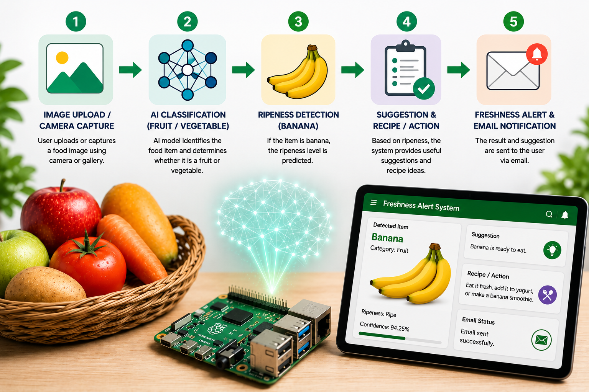

# AI-Powered Food Image Classification and Freshness Alert System Using Raspberry Pi

This project is a Raspberry Pi-based AI system for food image classification, banana ripeness detection, freshness suggestions, and email alerts.

The system first identifies selected fruits and vegetables from an uploaded or captured image. If the detected item is banana, a second model classifies the banana ripeness stage and provides a useful suggestion or recipe action. The result can also be sent through an email alert.
The image below summarizes the main workflow of the deployed Raspberry Pi system.


## Features

- Fruit and vegetable image classification
- Banana ripeness classification
- Flask web interface
- Image upload option
- Camera capture option through browser
- Freshness-based suggestions
- Recipe or action recommendation
- Gmail-based email alert
- Raspberry Pi deployment using TensorFlow Lite

## Trained Classes

The fruit and vegetable classification model was trained with six classes:

- apple
- banana
- carrot
- mango
- potato
- tomato

The banana ripeness model was trained with four classes:

- green
- ripe
- overripe
- rotten

## System Workflow

1. User uploads or captures a food image.
2. The first model classifies the image as one of the selected fruit or vegetable classes.
3. The system displays whether the item is a fruit or vegetable.
4. If the detected item is banana, the second model predicts the ripeness stage.
5. The system provides a suggestion and recipe/action.
6. If email settings are configured, the result is sent by email.

## Project Structure

```text
food-image-classification-freshness-alert/
│
├── train_models.py
├── convert_to_tflite.py
├── test_prediction.py
├── copy_selected_fruit_veg.py
├── copy_banana_ripeness.py
├── create_balanced_fruit_dataset.py
├── improve_banana_class.py
├── requirements.txt
├── .gitignore
│
└── raspberry_pi_app/
    ├── app.py
    ├── predict_pi.py
    └── models/
        ├── fruit_veg_model.tflite
        ├── fruit_veg_model_classes.txt
        ├── banana_ripeness_model.tflite
        └── banana_ripeness_model_classes.txt


## Dataset Acknowledgement

This project uses publicly available image datasets for academic prototype development.

- Fruit and Vegetable Image Recognition Dataset  
  Used for training the food image classification model with selected classes: apple, banana, carrot, mango, potato, and tomato.

- Banana Ripeness Classification Dataset  
  Used for training the banana ripeness model with four classes: green, ripe, overripe, and rotten.

The original datasets are not included in this repository. Users should download the datasets from their original sources and follow the dataset license and usage conditions.
